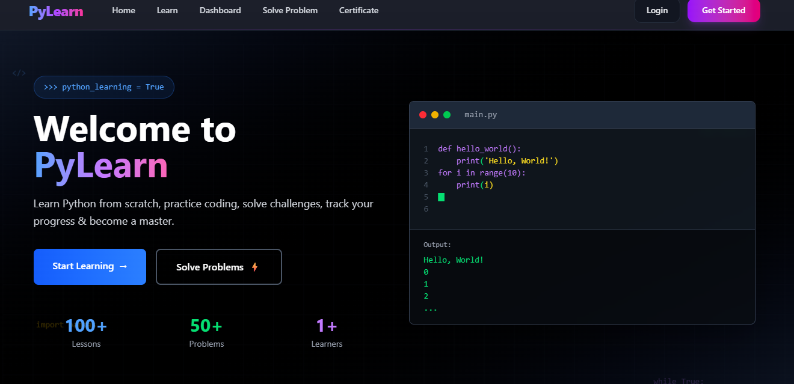
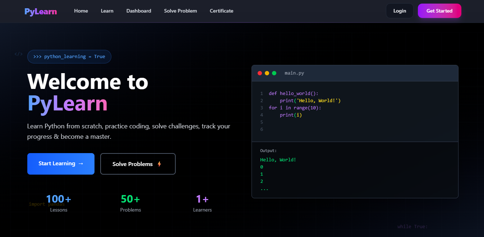
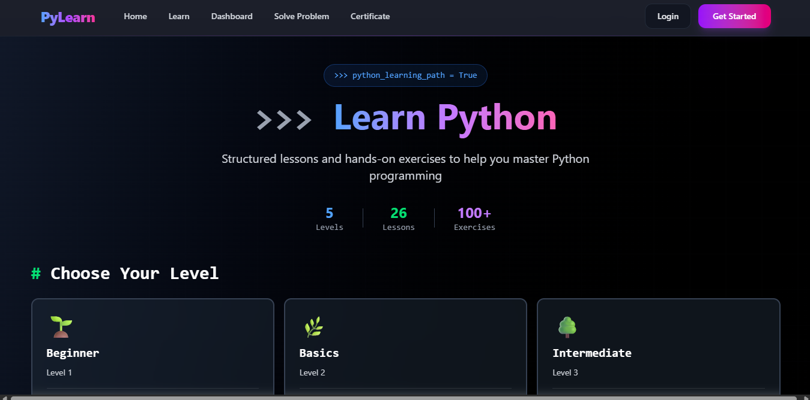
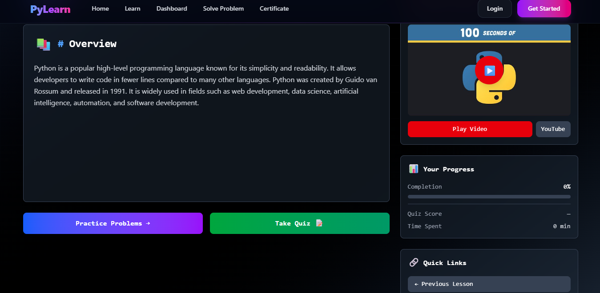
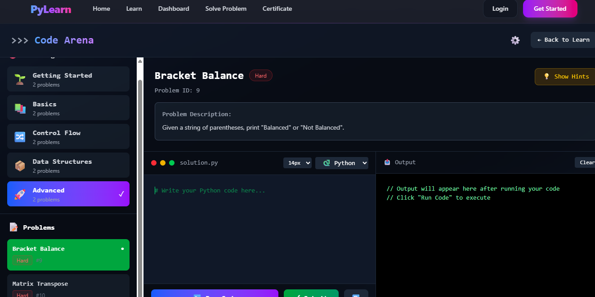
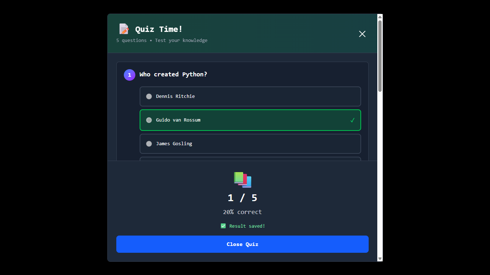
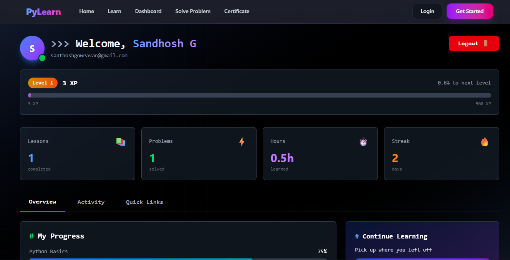
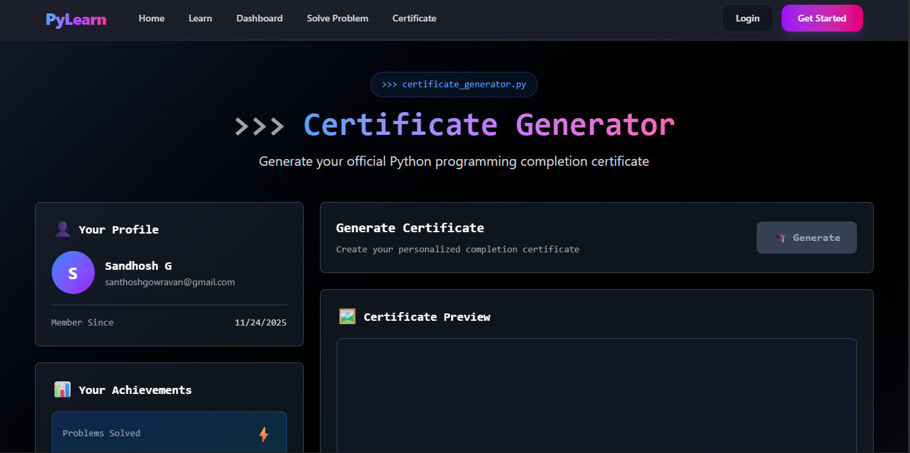
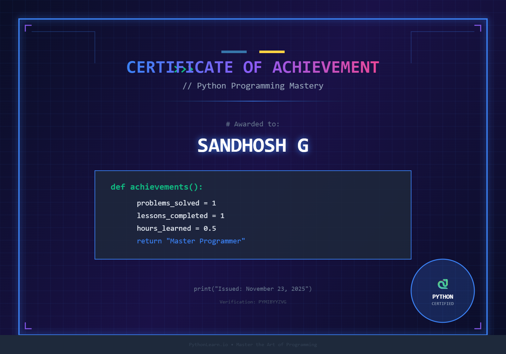

# PyLab (PyLearn)

A lightweight, interactive learning platform for Python — lessons, quizzes, coding challenges and an in-browser Python runner (Pyodide). This repository contains a Vite + React frontend and an Express + MySQL backend used by the application.

## Features
- Lesson viewer with YouTube / document resources
- Multiple-choice quizzes (MCQ) with anti-cheat measures
- Problem solving arena with an in-browser Python runner (Pyodide)
- Save MCQ results and problem attempts to MySQL
- Certificate generator (PNG) after solving 5 problems
- Dashboard with aggregated user stats and recent activity

## Repo structure (important parts)
- `Pylab/` — frontend + backend workspace
	- `src/` — React frontend pages and components
	- `backend/` — Express server, DB connection (`db.js`) and API (`server.js`)
	- `Db/pylab (2).sql` — SQL dump with schema and seed data

## Prerequisites
- Node.js (16+ recommended) and npm
- MySQL / MariaDB (import the provided SQL)
- Internet connection (Pyodide loads from CDN)

## Quick local setup

1. Import the database

	 - Create a database (e.g. `pylab`) and import `Pylab/Db/pylab (2).sql` using your preferred client (phpMyAdmin, MySQL CLI, Workbench).

		 Example (MySQL CLI):

		```markdown
		## Screenshots

		Below is a styled 3x3 gallery with spacing and a centered container. It looks good on GitHub and other Markdown renderers that support inline HTML. Replace the files in `Pylab/ss/` with your screenshots (or update the `src` paths if you place them elsewhere).

		<div style="max-width:1000px;margin:18px auto;padding:18px;background:#f8fafc;border-radius:12px;box-shadow:0 6px 18px rgba(20,20,30,0.06);">
			<div style="display:grid;grid-template-columns:repeat(3,1fr);gap:14px;align-items:stretch;">
				<figure style="margin:0;border-radius:8px;overflow:hidden;background:#fff;box-shadow:0 4px 10px rgba(10,10,20,0.04);">
					
				</figure>
				<figure style="margin:0;border-radius:8px;overflow:hidden;background:#fff;box-shadow:0 4px 10px rgba(10,10,20,0.04);">
					
				</figure>
				<figure style="margin:0;border-radius:8px;overflow:hidden;background:#fff;box-shadow:0 4px 10px rgba(10,10,20,0.04);">
					
				</figure>
				<figure style="margin:0;border-radius:8px;overflow:hidden;background:#fff;box-shadow:0 4px 10px rgba(10,10,20,0.04);">
					
				</figure>
				<figure style="margin:0;border-radius:8px;overflow:hidden;background:#fff;box-shadow:0 4px 10px rgba(10,10,20,0.04);">
					
				</figure>
				<figure style="margin:0;border-radius:8px;overflow:hidden;background:#fff;box-shadow:0 4px 10px rgba(10,10,20,0.04);">
					
				</figure>
				<figure style="margin:0;border-radius:8px;overflow:hidden;background:#fff;box-shadow:0 4px 10px rgba(10,10,20,0.04);">
					
				</figure>
				<figure style="margin:0;border-radius:8px;overflow:hidden;background:#fff;box-shadow:0 4px 10px rgba(10,10,20,0.04);">
					
				</figure>
				<figure style="margin:0;border-radius:8px;overflow:hidden;background:#fff;box-shadow:0 4px 10px rgba(10,10,20,0.04);">
					
				</figure>
			</div>
			<p style="margin:12px 0 0 0;color:#5b6170;font-size:13px;text-align:center;">Tip: Use optimized, consistent-sized images for the best result (recommended under 1MB each).</p>
		</div>

		Notes:
		- Create the folder `Pylab/ss/` (relative to this README) and add your nine PNG/JPG images named `1.png`..`9.png`, or update the `src` attributes to match your filenames.
		- If you prefer different dimensions, adjust the `height:220px` rule in the `` styles to your preferred aspect.
		- For very large images, consider resizing/optimizing before adding to the repo for faster loading on GitHub.

		``` 
	 - Install and run the frontend (Vite)

		 ```powershell
		 cd "D:/Xampp/htdocs/PyLab_Arena/Pylab"
		 npm install
		 npm run dev
		 ```

	 - By default the frontend uses `http://localhost:4000` as the API base. If your backend is hosted on a different URL, set `VITE_API_URL` in your environment before starting the frontend:

		 ```powershell
		 $env:VITE_API_URL = 'http://localhost:4000'; npm run dev
		 ```

## Important API endpoints (summary)
- `POST /api/register` — { name, email, password }
- `POST /api/login` — { email, password }
- `GET /api/levels` — list levels
- `GET /api/lessons` — list lessons (optional `?level=`)
- `GET /api/lessons/:id` — lesson details (content, youtube_link, document_link)
- `GET /api/lessons/:id/mcq` — fetch MCQs for a lesson
- `POST /api/lessons/:id/mcq/result` — save MCQ score { user_id, score }
- `GET /api/problems` — list problems
- `GET /api/problems/:id` — get single problem
- `POST /api/problems/:id/attempt` — save problem attempt { user_id, score, submission }
- `GET /api/users/:id/stats` — aggregated stats and recent activity

Note: Some endpoints return optional fields: `template` (starter code) and `expected_output` (used by the frontend to auto-judge). If the DB does not include those columns, the server will still work (it falls back gracefully).

## Certificates
- The frontend includes a client-side certificate generator at `/certificate`. It requires that the logged-in user has at least **5 solved problems** (this threshold is fixed). The certificate is drawn on canvas and downloaded as a PNG — no server-side composer required.

## Problem attempts and judging
- Attempts are saved in `problem_results`. The app saves the submission code (if `submission` column exists) and a numeric score (frontend uses 100 for correct, 0 for wrong by default).
- To store code on the server, add the `submission` column to `problem_results`:

```sql
ALTER TABLE problem_results ADD COLUMN submission TEXT DEFAULT NULL;
```

## Notes & next improvements
- If you want server-side certificate issuance or storage, I can add endpoints to save generated images and provide a user certificate history.
- For a richer editor, integrate Monaco or CodeMirror instead of the textarea used now.
- Consider adding server-side judging (sandboxed runner) if you want authoritative scoring rather than client-side Pyodide checks.

## Developer / Contact
- Sandhosh G — creator
	- GitHub: https://github.com/SANDHOSH02
	- Portfolio: https://sandhosh.vercel.app/
	- LinkedIn: https://www.linkedin.com/in/sandhosh-g-884b7b279/

## License
This project does not include a license file by default. Add a `LICENSE` file (MIT or similar) if you want to open-source it.

---
If you want, I can: add server-side eligibility checks for certificates, store generated certificates on the server, or migrate the editor to Monaco. Tell me which next step you'd like.

## Screenshots


Below is a simple 3x3 gallery — this will render on GitHub and other Markdown viewers. Replace the files in `ss/` with your actual screenshots.

<div style="display:flex;flex-wrap:wrap;gap:12px;justify-content:center">
	
	
	
	
	
	
	
	
	
</div>

Notes:
- Create the folder `ss/` at the repository root (same level as this `README.md`) and add your nine PNG/JPG images.
- Use optimized images (recommended under 1MB each) for faster loading on GitHub.
- If you prefer different filenames or JPG format, update the `src` attributes accordingly.


